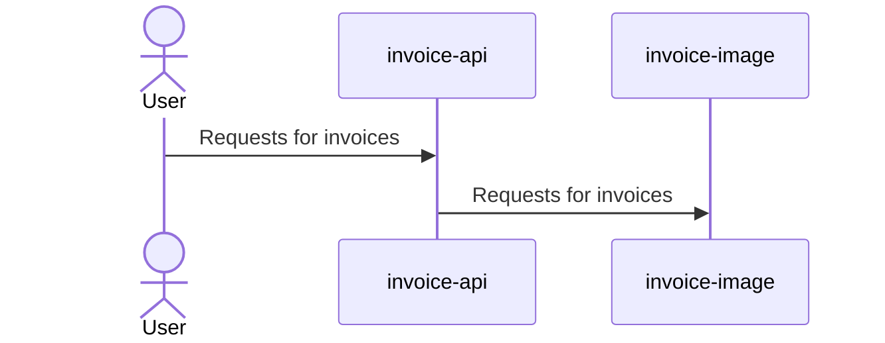

## Objective

Not clear on Jira ticket. Will assume that is to either fix or update info about it.


## Comments




Code in invoice-image for reference

```java
public List<Invoice> getInvoices(Integer customerId, JSONObject requestFilter) {  
  
    String fromDateString = (String) requestFilter.get("fromDate");  
    String toDateString = (String) requestFilter.get("toDate");  
    Date fromDate = getDate(fromDateString);  
    Date toDate = getDate(toDateString);  
    boolean validDates = validateDates(fromDate, toDate);  
    if (!validDates) {  
        logger.debug("Invalid Request: Date range exceeded!");  
        String errorMessage =  
                "bad-request: Range of export dates requested exceeds maximum days supported"  
                    + " (%s calendar days).  Please narrow export date range to %s days or less"  
                    + " and resubmit your request.";  
        throw new InvoiceImageException(  
                String.format(errorMessage, MAX_DATE_RANGE_IN_DAYS, MAX_DATE_RANGE_IN_DAYS));  
    }  
    return getInvoices(customerId, fromDate, toDate);  
}
```

## ❌ Theory 1 - Dates drift

First would be to check if expected date (exportDate) differs greatly from dequed date. 

```sql
SELECT ieq.DequeuedDate, ih.ExportDate
FROM tbl_InvoiceExportQueue ieq
JOIN tbl_InvoiceHeader ih USING (InvoiceHeaderID)
WHERE ih.InvoiceID = 'QA0051309785'
```

![[Pasted image 20260116110509.png]]


## Theory 2 - The date you are looking for is in another castle

For Curl
```bash
curl -X 'PUT' \
  'https://qa-service.chromeriver.com/v1/invoice-api/invoices' \
  -H 'accept: */*' \
  -H 'chain-id: TestInvoiceFilter' \
  -H 'customer-id: 922' \
  -H 'x-api-key: 1970e187-495c-4590-8f33-c1cdc4a4ef3e' \
  -H 'Content-Type: application/json' \
  -d '{
    "fromDate": "2025-12-22T00:01:00.000Z",
    "toDate": "2025-12-22T23:59:00.000Z"
  }'

[]
```

But...
```bash
❯ curl -X 'PUT' \
  'https://qa-service.chromeriver.com/v1/invoice-api/invoices' \
  -H 'accept: */*' \
  -H 'chain-id: TestInvoiceFilter' \
  -H 'customerId: 922' \
  -H 'x-api-key: 1970e187-495c-4590-8f33-c1cdc4a4ef3e' \
  -H 'Content-Type: application/json' \
  -d '{
    "fromDate": "2025-12-21T00:01:00.000Z",
    "toDate": "2025-12-23T23:59:00.000Z"
  }'

[{"invoiceId":"QA0051309785","invoiceNumber":"Test200Invoice","invoiceDate":"2025-12-19T00:00:00.000+0000","vendorUniqueId":"9950123","addressUniqueId":"CC944545-8666-6F01-FF2F-EE0B5C2B5BA5"}]%
````

```sql
SELECT ieq.DequeuedDate, ih.ExportDate, ih.CreateDate, ih.InvoiceDate
FROM tbl_InvoiceExportQueue ieq
JOIN tbl_InvoiceHeader ih USING (InvoiceHeaderID)
WHERE ih.InvoiceID = 'QA0051309785'
```

![[Pasted image 20260116112141.png]]

That date is using InvoiceDate.

Using the data we have this "filled in" query (a copy from the one in invoice-image) should be close to the one used and work.
```sql
SELECT
    ih.InvoiceID,
    ih.InvoiceNumber,
    ih.InvoiceDate AS InvoiceDate,
    iv.VendorUniqueID,
    iva.VendorAddressUniqueID AS AddressUniqueID
FROM
    tbl_InvoiceExportQueue ieq
    JOIN tbl_InvoiceHeader ih
        ON ieq.InvoiceHeaderID = ih.InvoiceHeaderID
    JOIN tbl_InvoiceVendor iv
        ON iv.InvoiceVendorID = ih.InvoiceVendorID
    JOIN tbl_InvoiceVendorAddress iva
        ON iva.VendorAddressID = ih.InvoiceVendorAddressID
WHERE
    ieq.QueueCode = 'EXP0'
    AND ieq.DequeuedDate >= '2025-12-22 00:01:00'
    AND ieq.DequeuedDate <= '2025-12-22 23:59:00'
    AND ieq.CustomerID = 922
    AND ih.CustomerID = 922
    AND (
        ih.StatusExport = 'EXPF'
      --  OR ih.StatusExport = 'PAID'
      --  OR ih.StatusExport = 'PARTIALLY_PAID'
    )
ORDER BY
    ih.InvoiceDate ASC;
```
![[Pasted image 20260116115123.png]]

It does.

The real issue:

> When in the same day, from and to date both get resolved to midnight
![[Pasted image 20260116120018.png]]

### Cause

The parsing was defaulting to a date-only parse.

Json format silently failing:
![[Captura de pantalla 2026-01-16 a las 12.28.18.png]]

Legacy format silently failing
![[Captura de pantalla 2026-01-16 a las 12.28.54.png]]

Process was defaulting to date-only
![[Pasted image 20260116122950.png]]

The payload is malformed:

```json
{
    "fromDate": "2025-12-22T00:01:00.000Z",
    "toDate": "2025-12-22T23:59:00.000Z"
}
```

JSON format pattern is not truly ISO-8601 safe.
```java
validDateFormats.add("yyyy-MM-dd'T'HH:mm:ss.SSSZ"); // JsonFormat
````

That `Z` in `SimpleDateFormat` means “RFC822 offset like `+0000`”

Depending on JVM/version, that may fail to parse with `SSSZ` (because it’s expecting `+0000`), which then triggers the fallback behavior above (eventually landing on a date-only interpretation if the string got transformed).

**Pre–Java 8 (legacy, still correct)**
```java
SimpleDateFormat sdf = new SimpleDateFormat("yyyy-MM-dd'T'HH:mm:ss.SSSX");
```

`X` was added in **Java 7** and **does** support `"Z"` properly.

**Java 8+ (recommended)**
```java
Instant.parse("2025-12-22T00:01:00.000Z");
```


## TODO 
 - [ ] Update openapi specification to include detailed info and correct apostrophes
- [x] Check if cahnges can be made ini date serialization in parser.


# Follow-up

## Domain leakage 

Due to the nature of this implementation it should live in invoice, not invoice-image.

## Flaky date conversion

The pattern to treat dates is present in other repos, it would be wise to update that for preventive manteinance.

 https://github.com/search?q=org%3AChrome-River%20validDateFormats.add(%22yyyy-MM-dd%27T%27HH%3Amm%3Ass.SSSZ%22)%3B%20%2F%2F%20JsonFormat&type=code


